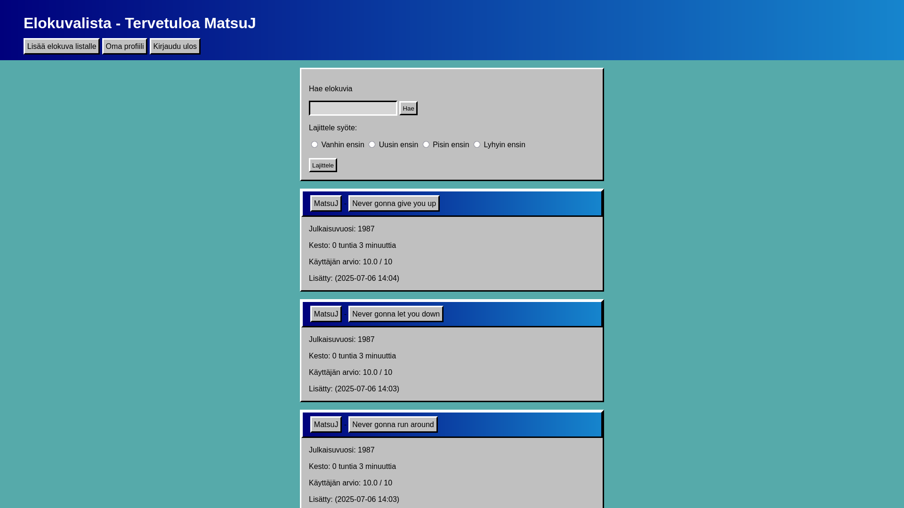
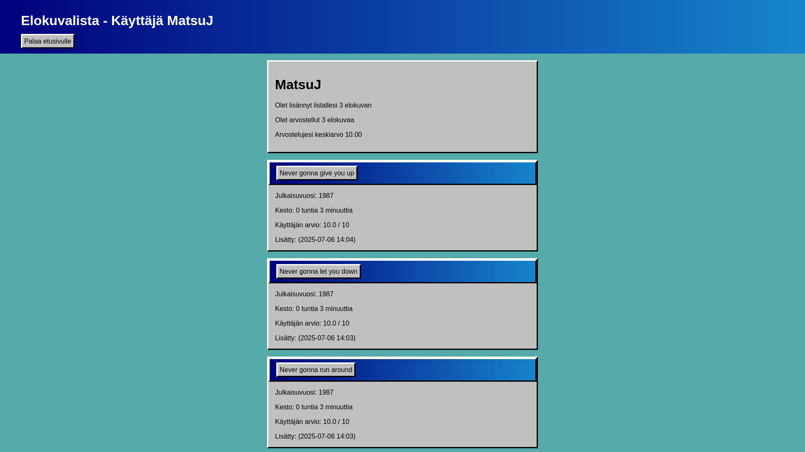
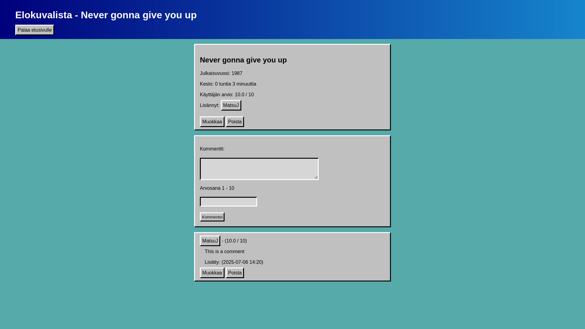

# Elokuvalista
Sovelluksen idea on olla lista, johon käyttäjät voivat lisätä elokuvia joita he ovat katsoneet tai haluavat katsoa. Käyttäjät voivat arvostella elokuvat ateikolla 0-10. Lisäksi elokvat voi järjestää muun muassa,pituuden tai julkaisuvuoden mukaisessa järjestyksessä.








## Sovelluksen toimintojen tilanne:

  ✅ Käyttäjä voi luoda tilin ja kirjautua sisään
  
  ✅ Käyttäjä voi lisätä elokuvan katsomislistalle
  
  ✅ Käyttäjä voi muokata katsomislistaansa

  ✅ Käyttäjä voi lajitella elokuvat julkaisuvuoden mukaan

  ✅ Käyttäjä voi lajitella elokuvat pituuden mukaan
  
  ✅ Käyttäjä voi arvostella elokuvia
  
  ✅ Käyttäjä voi kommentoida ja arvostella muiden listoilla olevia elokuvia
  
  ✅ Käyttäjä voi hakea elokuvia
  


## Asennusohjeet:

Vaatimukset:
- Python
- Poetry

Lataa koodi esimerkiksi git clone komennolla

```
git clone https://github.com/Matsu-J/Elokuvalista.git
```

Navigoi kansioon johon latasit koodin

Asenna projektin riippuvuudet ja käynnistä virtuaaliympäristö

```
poetry install

eval $(poetry env activate)
```


Luo sovelluksen tietokanta
```
sqlite3 database.db < schema.sql
```

Suorita sovellus komennolla
```
flask run
```
